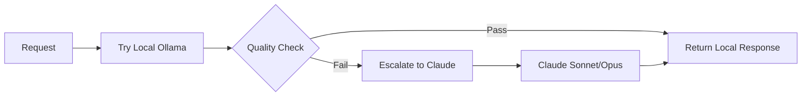

# AI Gateway

**Multi-provider AI gateway with OpenAI-compatible API, intelligent routing, caching, and cost optimization.**

[](https://www.python.org/)
[](https://fastapi.tiangolo.com/)
[](https://opensource.org/licenses/MIT)

---

## Overview

A unified API gateway that routes requests to multiple AI providers through a single OpenAI-compatible interface. Use Claude, local Ollama models, or let the gateway intelligently choose—all from Cursor, Continue, or any OpenAI SDK client.

### Supported Providers

| Provider | Models | Features |
|----------|--------|----------|
| **Anthropic Claude** | Sonnet, Opus, Haiku | Streaming, tool calls, prompt caching |
| **Local Ollama** | Qwen, Llama, DeepSeek, CodeLlama | Self-hosted, private, no API costs |

---

## Why Use This?

### The Problem

AI-powered IDEs like **Cursor** and **Continue** have limitations:

- **Massive repeated context** – Same instructions sent every request, burning tokens on duplicates
- **No caching** – Identical prompts billed repeatedly
- **Single provider** – Can't mix Claude for complex tasks with local models for simple ones
- **No routing control** – Can't auto-select Sonnet vs Opus based on task complexity
- **Opaque costs** – Hard to track usage across teams/projects
- **Vendor lock-in** – API keys and model choices locked in the IDE

### The Solution

This gateway sits between your clients and AI providers:

- **Multi-provider routing** – Use Claude, local models, or auto-select per request
- **70-80% token reduction** – Caching, deduplication, and prompt optimization
- **Smart routing** – Automatically use Opus for hard tasks, Sonnet for simple ones
- **Unified API** – One OpenAI-compatible endpoint for all providers
- **Full observability** – Prometheus metrics, usage tracking, cost monitoring
- **Production reliability** – Circuit breakers, retries, rate limiting

---

## Features

### Core Capabilities

- **OpenAI-Compatible API** – Drop-in replacement for any OpenAI SDK client
- **Multi-Provider Support** – Route to Claude, Ollama, or auto-select
- **Smart Model Routing** – Complexity-based routing between Sonnet/Opus
- **Full Tool Support** – OpenAI ↔ Anthropic tool call translation with streaming

### Cost Optimization

- **Response Caching** – 100% savings on repeated requests (Redis)
- **Anthropic Prompt Cache** – 80-90% savings on system prompts
- **File Deduplication** – 30-50% savings on unchanged file content
- **IDE Boilerplate Strip** – 20-30% savings removing repeated instructions
- **Diff-First Policy** – 50-70% savings returning diffs instead of full files

### Production Ready

- **Circuit Breakers** – Automatic failover on provider errors
- **Exponential Backoff** – Smart retry logic with rate limit handling
- **Rate Limiting** – Per-project request limits
- **Prometheus Metrics** – Full observability stack
- **Multi-Project Support** – Isolated configs, limits, and tracking per project

---

## Quick Start

### 1. Deploy to Railway

[](https://railway.app/template)

### 2. Set Environment Variables

**Required:** Set `GATEWAY_API_KEY` in Railway Variables (Dashboard → your service → Variables).  
If it is missing, the app exits on startup and the deployment healthcheck will fail with "service unavailable."

**Minimum (Claude only):**
```bash
ANTHROPIC_API_KEY=sk-ant-...    # Anthropic API key
GATEWAY_API_KEY=your-secret     # Client authentication
```

**With caching (recommended):**
```bash
REDIS_URL=redis://...           # Enables response caching
```

**With local models:**
```bash
LOCAL_LLM_BASE_URL=https://ollama.yourdomain.com
LOCAL_CF_ACCESS_CLIENT_ID=<service-token-id>
LOCAL_CF_ACCESS_CLIENT_SECRET=<service-token-secret>
```

**If the healthcheck fails with "service unavailable":**

- Railway’s healthcheck calls `GET /live` and expects **HTTP 200**. The app listens on the `PORT` Railway provides.
- **Set `PORT` in Railway Variables** (e.g. `8080`) so the healthcheck uses the same port as the app. This is required if you use a custom/target port.
- Ensure the app binds to `0.0.0.0` and uses `PORT` (the repo’s `start.sh` and `run_server.py` already do this).
- If you restrict requests by hostname, allow `healthcheck.railway.app` (see [Railway healthcheck docs](https://docs.railway.app/guides/healthchecks-and-restarts)).
- The deploy uses a 10-minute healthcheck window; if migrations or cold start are slow, the first few retries may fail before the app is ready.

### 3. Configure Your Client

**Cursor / Continue:**
```
Base URL: https://your-gateway.railway.app/v1
API Key: your-gateway-api-key
```

**OpenAI SDK:**
```python
from openai import OpenAI

client = OpenAI(
    base_url="https://your-gateway.railway.app/v1",
    api_key="your-gateway-api-key",
)

# Use Claude
response = client.chat.completions.create(
    model="claude-sonnet-4-0",
    messages=[{"role": "user", "content": "Hello!"}],
)

# Use local Ollama model
response = client.chat.completions.create(
    model="local:qwen2.5-coder:14b-instruct",
    messages=[{"role": "user", "content": "Hello!"}],
)

# Use smart routing (auto-select Sonnet/Opus)
response = client.chat.completions.create(
    model="auto",
    messages=[{"role": "user", "content": "Hello!"}],
)
```

---

## Provider Configuration

### Anthropic Claude (Default)

Claude is the default provider. Just set `ANTHROPIC_API_KEY` and requests route automatically.

**Models:**
- `claude-sonnet-4-0` / `sonnet` – Fast, cost-effective
- `claude-opus-4-5` / `opus` – Most capable
- `auto` / `smartroute` – Gateway auto-selects based on complexity

**Smart Routing:**

Set model to `auto` and the gateway analyzes request complexity:
- Simple queries → Sonnet (cheaper, faster)
- Complex reasoning, architecture, debugging → Opus (more capable)

Control per-request: `X-Gateway-Smart-Routing: 1|0` header or `"smart_routing": true|false` in body.

### Local Ollama

Run models locally via Cloudflare Access tunnel for privacy and zero API costs.

**Setup:**

1. Deploy Ollama behind Cloudflare Access tunnel
2. Create a service token with tunnel access
3. Configure environment variables:

```bash
LOCAL_LLM_BASE_URL=https://ollama.yourdomain.com
LOCAL_LLM_DEFAULT_MODEL=qwen2.5-coder:14b-instruct
LOCAL_CF_ACCESS_CLIENT_ID=<service-token-id>
LOCAL_CF_ACCESS_CLIENT_SECRET=<service-token-secret>
LOCAL_LLM_TIMEOUT_SECONDS=120  # Optional, default 120s
```

**Usage:**

```bash
# Option 1: Use provider field
curl -X POST https://your-gateway/v1/chat/completions \
  -H "Authorization: Bearer $GATEWAY_API_KEY" \
  -d '{"provider": "local", "messages": [{"role": "user", "content": "Hi"}]}'

# Option 2: Use model prefix
curl -X POST https://your-gateway/v1/chat/completions \
  -H "Authorization: Bearer $GATEWAY_API_KEY" \
  -d '{"model": "local:qwen2.5-coder:14b-instruct", "messages": [...]}'
```

**Allowed Models:**
- `qwen2.5-coder:14b-instruct` (default), `qwen2.5-coder:7b-instruct`, `qwen2.5-coder:32b-instruct`
- `qwen2.5:14b`, `qwen2.5:7b`
- `llama3.2:latest`, `llama3.1:8b`
- `codellama:13b`
- `deepseek-coder:6.7b`, `deepseek-coder-v2:16b`

Unknown models return HTTP 400.

**Limitations:**
- No streaming (returns complete response)
- No tool/function calling
- Latency depends on your hardware

---

## API Reference

### Endpoints

| Endpoint | Description |
|----------|-------------|
| `POST /v1/chat/completions` | OpenAI-compatible chat (streaming supported for Claude) |
| `POST /chat` | Simple chat endpoint |
| `GET /v1/models` | List available models (Claude + local) |
| `GET /health` | Health check |
| `GET /admin/metrics` | Prometheus metrics |
| `GET /admin/usage` | Usage statistics |

### Request Format

```json
{
  "model": "claude-sonnet-4-0",      // or "local:qwen2.5-coder:14b-instruct", "auto"
  "provider": "local",                // optional: "local" or omit for Claude
  "messages": [
    {"role": "system", "content": "You are helpful."},
    {"role": "user", "content": "Hello!"}
  ],
  "max_tokens": 1200,
  "temperature": 0.2,
  "stream": true,                     // Claude only
  "tools": [...]                      // Claude only
}
```

### Response Headers

```
X-Gateway: claude-gateway      # Confirms gateway routing
X-Provider: ollama             # Provider used (ollama/anthropic)
X-Model-Source: local|custom   # Model source
X-Cache: HIT|MISS              # Cache status
X-RateLimit-Remaining: 59      # Rate limit status
```

---

## Cascade Routing

**New Feature:** FrugalGPT-style cascade routing tries cheaper models first, escalates only when needed.

### How It Works



1. **Route:** Smart routing decides initial tier (local/sonnet/opus)
2. **Try Local:** If tier is "local", call Ollama first
3. **Quality Check:** Fast heuristics verify response quality
4. **Escalate:** If quality fails, escalate to Claude
5. **Learn:** Log outcomes to train future learned router

### Configuration

```bash
# Enable cascade routing (default: disabled)
ENABLE_CASCADE_ROUTING=1

# Quality check mode: "heuristic" (fast), "llm" (ask model to self-assess), "none" (always pass)
CASCADE_QUALITY_CHECK_MODE=heuristic

# Minimum response length for quality pass
CASCADE_MIN_RESPONSE_LENGTH=100

# Log routing outcomes for training data (default: enabled)
CASCADE_LOG_OUTCOMES=1
```

### Quality Checks

**Heuristic mode (< 50ms overhead):**
- Response length vs query complexity
- Refusal patterns ("I don't know", "I can't help")
- Code blocks present when code requested
- No excessive repetition
- Reasonable sentence structure

### Outcome Logging

Cascade logs routing decisions to `routing_outcomes` table:
- Initial tier (from Phase 1/2 routing)
- Final tier (after cascade/escalation)
- Whether escalated and why
- Quality score, latency, success

**Use case:** Train a learned router (RouteLLM, RoRF) using this data.

---

## Skills System

**New Feature:** Curated prompt templates for structured workflows, invokable via header.

### Available Skills

| Skill ID | Purpose | Use When |
|----------|---------|----------|
| `brainstorming` | Structured feature planning | Before writing new code |
| `systematic-debugging` | Methodical bug analysis | Stuck on an issue |
| `code-review` | Thorough review checklist | Before committing |
| `git-pushing` | Safe commit workflow | Ready to push |
| `concise-planning` | Break down large tasks | Large feature work |
| `architecture-review` | System design analysis | Architecture decisions |
| `quick-fix` | Minimal changes for simple issues | Typos, small bugs |
| `security-audit` | Vulnerability scan | Security concerns |

### Usage

Send `X-Gateway-Skill` header with skill ID:

```bash
curl -X POST https://your-gateway/v1/chat/completions \
  -H "Authorization: Bearer $GATEWAY_API_KEY" \
  -H "X-Gateway-Skill: brainstorming" \
  -d '{
    "messages": [{"role": "user", "content": "I want to add user authentication"}]
  }'
```

**From Cursor/Continue:**

Set a custom header in your IDE settings or use a wrapper script that adds the header.

### How It Works

1. Gateway detects `X-Gateway-Skill` header
2. Looks up skill prompt template from `gateway/skills.py`
3. **Prepends skill prompt to system prompt** before routing
4. Request proceeds normally with enhanced methodology

**Example:** `brainstorming` skill guides the AI through:
1. UNDERSTAND: Ask clarifying questions
2. REQUIREMENTS: List functional/non-functional requirements
3. CONSTRAINTS: Identify dependencies
4. DESIGN: Propose 2-3 approaches
5. DECISION: Recommend with rationale
6. SPEC: Output specification

### Configuration

```bash
# Enable skills system (default: enabled)
ENABLE_SKILLS=1
```

### Skill-Routing Synergy

Some skills can force a specific tier:
- `quick-fix` → local (simple edits don't need Claude)
- `architecture-review` → opus (needs deep reasoning)
- `security-audit` → opus (thorough analysis required)

Others let smart routing decide based on the actual query.

---

## Token Reduction

The gateway reduces token usage through multiple layers:

| Layer | Savings | Description |
|-------|---------|-------------|
| Response Cache | 100% on repeats | Identical requests return cached responses |
| Anthropic Prompt Cache | 80-90% on system | System prompts cached server-side |
| File Deduplication | 30-50% | Unchanged files replaced with hash references |
| IDE Boilerplate Strip | 20-30% | Removes repeated Cursor/Continue instructions |
| Diff-First Policy | 50-70% on edits | Model returns diffs instead of full files |

**Enable all optimizations:**
```bash
REDIS_URL=redis://...
ENABLE_ANTHROPIC_CACHE_CONTROL=1
ENABLE_FILE_HASH_CACHE=1
STRIP_IDE_BOILERPLATE=1
ENFORCE_DIFF_FIRST=1
```

---

## Environment Variables

### Required
```bash
GATEWAY_API_KEY=                # Client authentication key
ANTHROPIC_API_KEY=              # Required for Claude provider
```

### Local LLM Provider
```bash
LOCAL_LLM_BASE_URL=             # Ollama URL (e.g., https://ollama.yourdomain.com)
LOCAL_LLM_DEFAULT_MODEL=qwen2.5-coder:14b-instruct
LOCAL_LLM_TIMEOUT_SECONDS=120
LOCAL_CF_ACCESS_CLIENT_ID=      # Cloudflare Access service token ID
LOCAL_CF_ACCESS_CLIENT_SECRET=  # Cloudflare Access service token secret
```

### Caching & Token Reduction
```bash
REDIS_URL=                      # Redis connection (enables caching)
CACHE_TTL_SECONDS=1800          # Response cache TTL
ENABLE_ANTHROPIC_CACHE_CONTROL=1
ENABLE_FILE_HASH_CACHE=1
STRIP_IDE_BOILERPLATE=1
ENFORCE_DIFF_FIRST=1
```

### Limits
```bash
SYSTEM_MAX_CHARS=40000
USER_MSG_MAX_CHARS=120000
TOOL_RESULT_MAX_CHARS=20000
DEFAULT_MAX_TOKENS=1200
```

### Reliability
```bash
CIRCUIT_BREAKER_ENABLED=1
RETRY_ENABLED=1
RATE_LIMIT_ENABLED=1
RATE_LIMIT_RPM=60
```

### Advanced
```bash
DATABASE_URL=                   # PostgreSQL (enables usage tracking, multi-project)
ENABLE_MULTI_PROJECT=0
ENABLE_SMART_ROUTING=1
SMART_ROUTING_MODE=local_first  # "local_first" | "keyword"
PROMETHEUS_ENABLED=1
ENABLE_CASCADE_ROUTING=0        # Try local first, escalate if needed
CASCADE_QUALITY_CHECK_MODE=heuristic
CASCADE_LOG_OUTCOMES=1
ENABLE_SEMANTIC_ROUTING_SIGNAL=0  # Use embeddings (Phase B)
ENABLE_SKILLS=1                 # Curated prompt templates
```

---

## Architecture

```
Client (Cursor/Continue/SDK)
              │
              ▼
┌──────────────────────────────────────┐
│            AI Gateway                │
├──────────────────────────────────────┤
│  Authentication & Rate Limiting      │
│              │                       │
│  Token Reduction Layer               │
│  • IDE boilerplate stripping         │
│  • File hash deduplication           │
│  • Context pruning                   │
│              │                       │
│  Provider Router                     │
│  ├─ provider=local    → Ollama       │
│  ├─ model=local:*     → Ollama       │
│  ├─ model=auto        → Smart Route  │
│  └─ default           → Claude       │
│              │                       │
│  Reliability Layer                   │
│  • Circuit breaker                   │
│  • Exponential backoff               │
│  • Automatic failover                │
└──────────────────────────────────────┘
              │
       ┌──────┴──────┐
       ▼             ▼
  Anthropic      Ollama
  Claude API     (via CF Tunnel)
```

---

## Monitoring

### Prometheus Metrics

```bash
curl https://your-gateway/admin/metrics -H "X-API-Key: $ADMIN_KEY"
```

Key metrics:
- `gateway_requests_total{provider, model, status}` – Request count
- `gateway_tokens_total{provider, model, direction}` – Token usage
- `gateway_cache_hits_total` – Cache hit rate
- `gateway_cost_usd_total` – Cost tracking (Claude only)
- `gateway_latency_seconds` – Request latency histogram

---

## Error Handling

| Scenario | Status | Description |
|----------|--------|-------------|
| Missing API key | 401 | `GATEWAY_API_KEY` not provided |
| Local provider not configured | 500 | Missing `LOCAL_LLM_*` env vars |
| Model not in allowlist | 400 | Requested local model not allowed |
| Provider unreachable | 502 | Claude/Ollama connection failed |
| Provider timeout | 504 | Request exceeded timeout |
| Rate limit exceeded | 429 | Too many requests |
| Circuit breaker open | 503 | Provider temporarily unavailable |

---

## Project Structure

```
├── app.py                     # FastAPI entrypoint
├── gateway/
│   ├── config.py              # Environment configuration
│   ├── anthropic_client.py    # Claude provider
│   ├── providers/
│   │   └── ollama.py          # Local Ollama provider
│   ├── cache.py               # Redis caching
│   ├── token_reduction.py     # Truncation & boilerplate removal
│   ├── smart_routing.py       # Complexity-based model selection
│   ├── circuit_breaker.py     # Reliability patterns
│   ├── routers/
│   │   ├── openai.py          # /v1/chat/completions
│   │   ├── chat.py            # /chat
│   │   ├── admin.py           # /admin/* endpoints
│   │   └── health.py          # /health
│   └── ...
└── docs/
    └── USER_GUIDE.md          # Detailed usage guide
```

---

## Documentation

- [User Guide](docs/USER_GUIDE.md) – Complete setup and configuration
- [API Reference](#api-reference) – Endpoints and request format
- [Environment Variables](#environment-variables) – All configuration options

---

## License

MIT

---

## Keywords

`ai-gateway` `llm-proxy` `openai-compatible` `anthropic` `claude` `ollama` `multi-provider` `cursor` `continue` `token-optimization` `prompt-caching` `fastapi` `python` `smart-routing` `cost-optimization` `rate-limiting` `circuit-breaker` `self-hosted` `local-llm`
